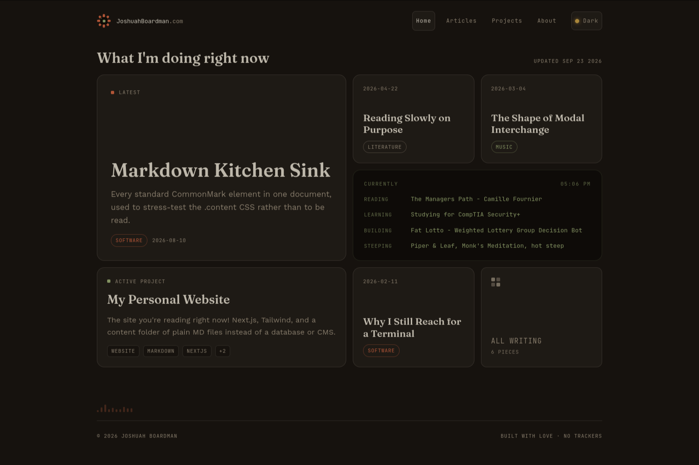

## My Personal Website

A simple warm bento inspired website written using Typescript, NextJs and Tailwind for displaying projects and publishing content about what I'm doing. 



## Features

- Markdown-based content. Articles and projects as `.md` files with frontmatter, no database or CMS
- Static generation for content pages via Next.js App Router (`generateStaticParams`)
- Tag and sort-based filtering with shareable, URL-synced filter state
- Auto-generated table of contents per article/project
- Light/dark mode
- RSS feed, sitemap, and Open Graph metadata
- Minimal client-side JavaScript. Server components by default

## Tech Stack

- **Framework**: Next.js (App Router)
- **Language**: TypeScript
- **Styling**: Tailwind CSS v4
- **Content**: `gray-matter`, `remark`, `remark-rehype`, `rehype-slug`, `unist-util-visit`, `github-slugger`
- **RSS**: `feed`
- **Package manager**: pnpm
- **Deployment**: Vercel


## Setup

If you want to run my website locally

1. Clone the repository
   ```bash
   git clone https://github.com/JoshuahBoardman/personal-website.git
   cd personal-website
   ```

2. Install dependencies
   ```bash
   pnpm install
   ```

3. Run the development server
   ```bash
   pnpm dev
   ```
   Open [http://localhost:3000](http://localhost:3000)

4. Build for production
   ```bash
   pnpm build
   pnpm start
   ```

## Usage

Add a new article or project by dropping a `.md` file into `content/articles/`
or `content/projects/`, with frontmatter matching the existing files as a
template. The homepage, feeds, and filters pick up new content automatically
on the next build. No admin panel, no database, just files.

## Status

**Shipped!** The core site (content pipeline, filtering, dark mode, RSS/sitemap/OG
metadata) is done and deployed. Ongoing work is mostly writing: new articles
and projects get added the same way any other content does.

At some point I may add pagination and various other small additions.

## Write-up

Read more about this project: [Building my personal site](https://joshuahboardman.com/articles/building-my-personal-site)
